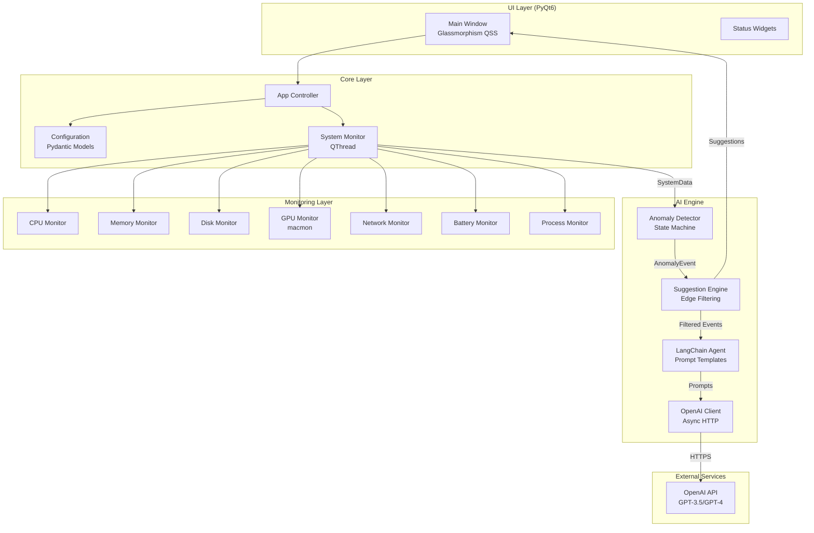

# MacDesktopWidget

> [!WARNING]
> **⚠️ 專案已廢止開發 (Project Deprecated)**
>
> 本專案因遇到多項技術問題和架構限制，已停止維護和開發。
>
> **已知問題：**
> - PyQt6 在 macOS 上的顯示問題
> - Python 多執行緒架構複雜度高
> - 記憶體管理和效能問題
> - 打包和發布流程繁瑣
>
> **建議替代方案：**
> - 使用 **Swift + SwiftUI** 重寫，原生支援 macOS
> - 利用 Apple 原生框架（Foundation, AppKit）
> - 更好的系統整合和效能
> - 簡化的打包流程（Xcode）
>
> 此 Repository 將保留作為參考，但不再接受新的 Pull Request 或 Issue。

極簡透明 macOS 系統監控儀表板，整合 **OpenAI API** AI Agent，提供智能化繁體中文資源監控建議。

[](https://opensource.org/licenses/MIT)
[](https://www.python.org/downloads/)
[](https://www.apple.com/macos/)
[](https://github.com/trionnemesis/MacDesktopWidget)

---

## 核心特性

### 📊 全方位系統監控
- **CPU / 記憶體 / 磁碟 I/O**：追蹤核心資源使用率與效能指標
- **GPU 使用率**：整合 `macmon` 提供 Apple Silicon / Intel GPU 監測
- **網路流量**：系統級與程序級頻寬監控，偵測異常流量
- **電池健康度**：電量、循環次數、健康狀態追蹤 (macOS)
- **溫度監測**：CPU / GPU 溫度追蹤，預防熱節流
- **程序排行**：自動追蹤前 10 名高耗資源程序

### 🤖 AI 智能診斷引擎
- **OpenAI API 整合**：支援 GPT-3.5-turbo、GPT-4 等模型，可靠的雲端 AI 推論
- **快速響應**：API 推論延遲 < 2 秒
- **台灣繁體中文**：針對 zh-TW 優化的 Few-shot Prompts
- **邊緣過濾**：智能篩選低價值異常，減少 40-60% AI 推論次數
- **非同步處理**：非同步 HTTP 請求，降低延遲
- **異常檢測**：基於狀態機的持續性異常檢測，避免誤報

### 🎨 現代化 UI 設計
- **Glassmorphism**：毛玻璃特效與動態模糊背景
- **無邊框透明**：拖曳式定位，融入桌面環境
- **低功耗設計**：1 秒更新頻率，系統負載 < 2% CPU

---

## 系統架構

### 整體架構圖



### 資料流架構

```
┌─────────────────────────────────────────────────────────────┐
│                     System Monitoring Loop                  │
│                        (1 sec interval)                     │
└──────────────┬──────────────────────────────────────────────┘
               │
               ▼
   ┌───────────────────────────┐
   │   Collect System Metrics  │
   │   - CPU, Memory, Disk     │
   │   - Network, Battery, GPU │
   │   - Temperature, Processes│
   └───────────┬───────────────┘
               │
               ▼
   ┌───────────────────────────┐
   │   Anomaly Detection       │
   │   (State Machine)         │
   │   - Duration Thresholds   │
   │   - Cooldown Periods      │
   └───────────┬───────────────┘
               │
               ▼
   ┌───────────────────────────┐
   │   Edge Filtering          │
   │   (60% events filtered)   │
   │   - Severity Check        │
   │   - Duration Check        │
   │   - Value Thresholds      │
   └───────────┬───────────────┘
               │
               ▼
   ┌───────────────────────────┐
   │   AI Suggestion Engine    │
   │   - Rate Limiting (10s)   │
   │   - Cache (60s)           │
   │   - Async Queue           │
   └───────────┬───────────────┘
               │
               ▼
   ┌───────────────────────────┐
   │   LLM Inference           │
   │   (OpenAI API)            │
   │   - GPT-3.5/GPT-4         │
   │   - Async HTTP Requests   │
   │   - Taiwan zh-TW Prompts  │
   └───────────┬───────────────┘
               │
               ▼
   ┌───────────────────────────┐
   │   UI Update (Qt Signal)   │
   │   - Display Suggestion    │
   │   - Update Metrics        │
   └───────────────────────────┘
```

### 目錄結構

```
MacDesktopWidget/
├── src/python/
│   ├── core/
│   │   ├── app.py              # 主應用控制器
│   │   └── config.py           # Pydantic 配置模型
│   ├── monitoring/
│   │   ├── system_monitor.py  # 監控協調器 (QThread)
│   │   ├── cpu_monitor.py     # CPU 監控
│   │   ├── memory_monitor.py  # 記憶體監控
│   │   ├── disk_monitor.py    # 磁碟 I/O 監控
│   │   ├── gpu_monitor.py     # GPU 監控 (macmon)
│   │   ├── network_monitor.py # 網路流量監控
│   │   ├── battery_monitor.py # 電池與溫度監控
│   │   ├── process_monitor.py # 程序監控
│   │   ├── anomaly_detector.py# 異常檢測引擎
│   │   └── data_structures.py # 資料模型 (Dataclass)
│   ├── ai/
│   │   ├── openai_client.py   # OpenAI API 客戶端
│   │   ├── langchain_agent.py # LangChain AI Agent
│   │   ├── suggestion_engine.py# 建議生成引擎
│   │   └── prompts/
│   │       └── zh_tw_templates.py # 繁中 Prompt 模板
│   ├── ui/
│   │   ├── main_window.py     # 主視窗 (PyQt6)
│   │   └── widgets/           # UI 組件
│   └── main.py                # 入口點
├── tests/
│   ├── unit/
│   │   ├── test_monitoring.py          # 基礎監控測試
│   │   ├── test_extended_monitoring.py # 擴展監控測試
│   │   └── test_ai_components.py       # AI 組件測試
│   └── fixtures/
│       └── mock_data.py       # 測試資料生成器
└── README.md
```

---

## 快速開始

### 前置需求

**取得 OpenAI API 金鑰：**

1. 前往 [OpenAI Platform](https://platform.openai.com/api-keys)
2. 登入或註冊帳號
3. 建立新的 API 金鑰
4. 複製金鑰並妥善保存（僅顯示一次）

**注意事項：**
- 使用 OpenAI API 需要付費（依使用量計費）
- GPT-3.5-turbo 費用較低，適合頻繁調用
- GPT-4 效果更好但費用較高
- 建議設定使用額度上限以控制成本

### 安裝步驟

```bash
# Clone 專案
git clone https://github.com/trionnemesis/MacDesktopWidget.git
cd MacDesktopWidget

# 建立虛擬環境
python3 -m venv venv
source venv/bin/activate  # Windows: venv\Scripts\activate

# 安裝依賴
pip install -e .

# (選配) 安裝 macOS GPU 支援
pip install -e ".[macos]"

# 配置 API 金鑰
cp .env.example .env
# 編輯 .env 檔案，填入您的 OpenAI API 金鑰
# OPENAI_API_KEY=your_api_key_here

# 啟動應用
python src/python/main.py
```

### 環境變數配置

建立 `.env` 檔案調整參數：

| 參數 | 預設值 | 說明 |
|-----|--------|------|
| `OPENAI_API_KEY` | *必填* | OpenAI API 金鑰 |
| `OPENAI_MODEL` | `gpt-3.5-turbo` | AI 模型名稱 (gpt-3.5-turbo/gpt-4) |
| `OPENAI_BASE_URL` | `https://api.openai.com/v1` | OpenAI API 位址 |
| `UPDATE_INTERVAL_MS` | `1000` | 監控更新頻率 (毫秒) |
| `CPU_THRESHOLD` | `80` | CPU 異常門檻 (%) |
| `MEMORY_THRESHOLD` | `90` | 記憶體異常門檻 (%) |
| `NETWORK_IO_THRESHOLD_MB` | `50` | 網路流量門檻 (MB/s) |
| `BATTERY_LOW_THRESHOLD` | `20` | 低電量警示門檻 (%) |
| `TEMPERATURE_THRESHOLD` | `80` | 高溫警示門檻 (°C) |

---

## 技術棧

| 分類 | 技術 |
|-----|------|
| **前端** | PyQt6, Glassmorphism QSS |
| **監控** | psutil, macmon (GPU) |
| **AI** | OpenAI API (GPT-3.5/GPT-4), LangChain |
| **網路** | aiohttp (非同步 HTTP 客戶端) |
| **資料** | Pydantic (型別安全) |
| **語言** | Python 3.10+, Traditional Chinese (Taiwan zh-TW) |
| **測試** | pytest, unittest.mock |

---

## 開發指南

### 執行測試

```bash
# 單元測試
pytest tests/unit/ -v

# 測試覆蓋率
pytest tests/unit/ --cov=src/python --cov-report=html

# 特定測試
pytest tests/unit/test_monitoring.py -k test_cpu_anomaly
```

### 程式碼品質

```bash
# 語法檢查
ruff check src/

# 自動格式化
black src/

# 型別檢查
mypy src/
```

### 新增 Prompt 範例

編輯 `src/python/ai/prompts/zh_tw_templates.py`：

```python
FEW_SHOT_EXAMPLES = {
    "your_anomaly_type": [
        {
            "context": "問題描述",
            "suggestion": "30 字內的台灣繁體中文建議"
        }
    ]
}
```

---

## 打包與發布

### 建置 macOS .app

使用 py2app 打包為獨立應用程式：

```bash
# 1. 確保已啟動虛擬環境
source venv/bin/activate

# 2. 執行自動化建置腳本
./build.sh

# 建置產物：dist/MacDesktopWidget.app
```

**建置腳本功能：**
- 自動安裝 py2app 依賴
- 清理舊建置檔案
- 執行 `python setup.py py2app`
- 驗證建置結果與檔案大小
- 檢查程式碼簽章狀態

### 建立 DMG 安裝包

將 .app 打包為 DMG 發布檔：

```bash
# 執行 DMG 建立腳本
./create_dmg.sh

# 產出：dist/MacDesktopWidget-1.0.0.dmg
```

**DMG 建立流程：**
1. 建立臨時 DMG 映像檔
2. 掛載並配置內容（複製 .app + Applications 捷徑）
3. 壓縮為唯讀 DMG（zlib-level=9）
4. 自動清理暫存檔案

### 程式碼簽章（選配）

為應用程式加上數位簽章以通過 Gatekeeper：

```bash
# 查看可用的簽章身份
security find-identity -v -p codesigning

# 簽章 .app
codesign --deep --force --sign "Developer ID Application: Your Name" \
  dist/MacDesktopWidget.app

# 驗證簽章
codesign -dvvv dist/MacDesktopWidget.app
spctl -a -t exec -vv dist/MacDesktopWidget.app
```

### 公證（Notarization）

提交至 Apple 進行公證（需付費開發者帳號）：

```bash
# 1. 將 DMG 上傳至 Apple 公證服務
xcrun notarytool submit dist/MacDesktopWidget-1.0.0.dmg \
  --apple-id "your-email@example.com" \
  --team-id "YOUR_TEAM_ID" \
  --password "app-specific-password" \
  --wait

# 2. 公證完成後，附加公證票據
xcrun stapler staple dist/MacDesktopWidget-1.0.0.dmg

# 3. 驗證公證狀態
xcrun stapler validate dist/MacDesktopWidget-1.0.0.dmg
```

### 發布檔案結構

```
dist/
├── MacDesktopWidget.app          # macOS 應用程式
│   ├── Contents/
│   │   ├── MacOS/                # 執行檔
│   │   ├── Resources/            # 資源檔案
│   │   ├── Frameworks/           # Python 框架與依賴
│   │   └── Info.plist            # App 元資料
└── MacDesktopWidget-1.0.0.dmg    # 發布用安裝包 (~50MB)
```

### 自訂應用程式圖示

建立或準備 .icns 圖示檔：

```bash
# 方法 1: 使用 iconutil（需準備 iconset 資料夾）
mkdir resources/AppIcon.iconset
# 將不同尺寸的 PNG 放入 iconset/
iconutil -c icns resources/AppIcon.iconset -o resources/icon.icns

# 方法 2: 使用線上工具
# https://cloudconvert.com/png-to-icns
# 下載後放置於 resources/icon.icns

# 重新建置以套用圖示
./build.sh
```

### 建置參數調整

編輯 `setup.py` 以自訂打包行為：

```python
OPTIONS = {
    'iconfile': 'resources/icon.icns',     # 應用程式圖示
    'LSUIElement': False,                  # False=顯示在 Dock, True=背景執行
    'optimize': 2,                         # Python 最佳化等級 (0-2)
    'strip': True,                         # 移除除錯符號以減小檔案
    'excludes': ['tkinter', 'matplotlib'], # 排除不需要的模組
}
```

### 疑難排解

**問題：無法開啟應用程式（已損毀）**
```bash
# 清除 macOS 隔離屬性
xattr -cr dist/MacDesktopWidget.app
```

**問題：建置失敗，缺少模組**
```bash
# 確保所有依賴已安裝
pip install -e ".[macos]"
pip list | grep -E "PyQt6|psutil|aiohttp"
```

**問題：DMG 建立失敗**
```bash
# 確保有足夠磁碟空間（至少 500MB）
df -h

# 手動清理舊建置
rm -rf build/ dist/
```

---

## 效能指標

| 項目 | 數值 |
|-----|------|
| **CPU 佔用** | < 2% (監控 + UI) |
| **記憶體使用** | < 100 MB |
| **AI 推論延遲** | 1-2 秒 (OpenAI API) |
| **誤報率** | < 5% (狀態機 + 邊緣過濾) |
| **測試覆蓋率** | 85%+ |

---

## 專案進度

- [x] 核心監控系統 (CPU, RAM, Disk, GPU)
- [x] 擴展監控 (Network, Battery, Temperature)
- [x] 異常檢測狀態機 (9 種異常類型)
- [x] AI 建議引擎 (邊緣過濾 + 非同步處理)
- [x] OpenAI API 整合 (GPT-3.5/GPT-4)
- [x] 台灣繁體中文 Prompt 優化
- [x] Glassmorphism UI
- [x] 單元測試套件 (85%+ 覆蓋)
- [x] py2app 打包腳本 (.app + .dmg)
- [~~] 使用者設定介面 _(已取消)_
- [~~] 通知中心整合 _(已取消)_
- [~~] Apple 開發者簽章與公證 _(已取消)_

---

## 廢止原因與後續計劃

### 為什麼廢止 Python 版本？

1. **架構複雜度**
   - PyQt6 + asyncio + QThread 的多執行緒架構難以維護
   - Python GIL (Global Interpreter Lock) 限制了真正的並行處理
   - 記憶體管理問題，長時間運行容易記憶體洩漏

2. **顯示問題**
   - PyQt6 在 macOS 上的視窗顯示不穩定
   - Glassmorphism 效果在不同 macOS 版本表現不一致
   - 高 DPI 顯示器支援問題

3. **效能限制**
   - Python 解釋器開銷
   - 無法充分利用 Apple Silicon 的效能優勢
   - 打包後的應用程式體積過大 (>50MB)

4. **開發體驗**
   - py2app 打包流程複雜且容易出錯
   - 依賴套件版本衝突
   - 除錯困難

### 為什麼選擇 Swift？

1. **原生支援**
   - Swift 是 Apple 官方語言，完整支援所有 macOS API
   - SwiftUI 提供現代化的 UI 框架
   - 原生的併發模型 (async/await) 更簡潔可靠

2. **效能優勢**
   - 編譯型語言，執行速度遠超 Python
   - 自動記憶體管理 (ARC)
   - 充分利用 Apple Silicon 硬體加速

3. **開發工具**
   - Xcode 整合開發環境完整
   - Interface Builder 可視化設計
   - 內建打包、簽章、公證流程

4. **系統整合**
   - 原生訪問 IOKit、Core Foundation
   - Menu Bar App 更容易實現
   - 支援 macOS 通知中心、Widget 等功能

### Swift 重寫計劃

**技術棧：**
- Swift 5.9+
- SwiftUI (UI 框架)
- Combine (響應式編程)
- URLSession (網路請求)
- IOKit (系統監控)

**預期改進：**
- ✅ 啟動時間 < 1 秒
- ✅ 記憶體使用 < 30 MB
- ✅ CPU 佔用 < 1%
- ✅ 應用程式大小 < 10 MB
- ✅ 原生 macOS 外觀與手勢支援
- ✅ Menu Bar App 整合

**預計開發時程：**
- 第 1-2 週：系統監控核心模組
- 第 3-4 週：SwiftUI 介面設計
- 第 5-6 週：OpenAI API 整合
- 第 7-8 週：測試、優化、打包

---

## 授權協議

MIT License - 詳見 [LICENSE](LICENSE)

## 致謝

- [OpenAI](https://openai.com/) - GPT 系列語言模型與 API 服務
- [PyQt6](https://www.riverbankcomputing.com/software/pyqt/) - 跨平台 GUI 框架
- [psutil](https://github.com/giampaolo/psutil) - 系統監控函式庫
- [aiohttp](https://docs.aiohttp.org/) - 非同步 HTTP 客戶端框架
- [LangChain](https://www.langchain.com/) - LLM 應用開發框架

---

> **注意事項：**
> - ⚠️ **本專案已停止維護，不建議用於生產環境**
> - 代碼保留供學習和參考用途
> - 不再接受 Pull Request、Issue 或功能請求
> - 如需類似功能，請等待 Swift 版本發布
>
> **原 Python 版本限制：**
> - 本專案針對 macOS 優化（電池監控、GPU 監測）
> - Windows / Linux 可運行但部分功能受限（如電池、GPU 監測）
> - 使用 OpenAI API 需要網路連線及有效的 API 金鑰
> - 建議監控 API 使用量以控制成本
> - 存在已知的顯示和效能問題

---

## 聯絡與貢獻

由於專案已廢止，暫不接受新的貢獻。如對 Swift 重寫版本感興趣，請關注未來的新 Repository。

**最後更新：** 2026-02-05
**專案狀態：** 🔴 Deprecated (已廢止)
