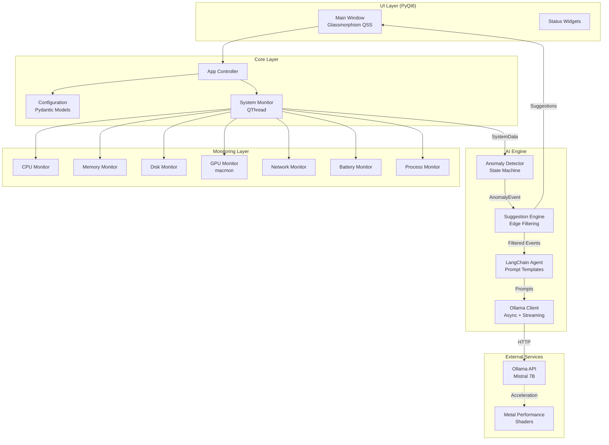

# MacDesktopWidget

極簡透明 macOS 系統監控儀表板，整合 **Ollama + Mistral 7B** AI Agent，提供智能化繁體中文資源監控建議。

[](https://opensource.org/licenses/MIT)
[](https://www.python.org/downloads/)
[](https://www.apple.com/macos/)

---

## 核心特性

### 📊 全方位系統監控
- **CPU / 記憶體 / 磁碟 I/O**：追蹤核心資源使用率與效能指標
- **GPU 使用率**：整合 `macmon` 提供 Apple Silicon / Intel GPU 監測
- **網路流量**：系統級與程序級頻寬監控，偵測異常流量
- **電池健康度**：電量、循環次數、健康狀態追蹤 (macOS)
- **溫度監測**：CPU / GPU 溫度追蹤，預防熱節流
- **程序排行**：自動追蹤前 10 名高耗資源程序

### 🤖 AI 智能診斷引擎
- **本地 LLM 推論**：Ollama + Mistral 7B Instruct，完全離線運行
- **Metal GPU 加速**：macOS 自動使用 Metal Performance Shaders，推論延遲 < 2 秒
- **台灣繁體中文**：針對 zh-TW 優化的 Few-shot Prompts
- **邊緣過濾**：智能篩選低價值異常，減少 40-60% AI 推論次數
- **串流輸出**：非同步流式處理，降低首字延遲
- **異常檢測**：基於狀態機的持續性異常檢測，避免誤報

### 🎨 現代化 UI 設計
- **Glassmorphism**：毛玻璃特效與動態模糊背景
- **無邊框透明**：拖曳式定位，融入桌面環境
- **低功耗設計**：1 秒更新頻率，系統負載 < 2% CPU

---

## 系統架構

### 整體架構圖



### 資料流架構

```
┌─────────────────────────────────────────────────────────────┐
│                     System Monitoring Loop                  │
│                        (1 sec interval)                     │
└──────────────┬──────────────────────────────────────────────┘
               │
               ▼
   ┌───────────────────────────┐
   │   Collect System Metrics  │
   │   - CPU, Memory, Disk     │
   │   - Network, Battery, GPU │
   │   - Temperature, Processes│
   └───────────┬───────────────┘
               │
               ▼
   ┌───────────────────────────┐
   │   Anomaly Detection       │
   │   (State Machine)         │
   │   - Duration Thresholds   │
   │   - Cooldown Periods      │
   └───────────┬───────────────┘
               │
               ▼
   ┌───────────────────────────┐
   │   Edge Filtering          │
   │   (60% events filtered)   │
   │   - Severity Check        │
   │   - Duration Check        │
   │   - Value Thresholds      │
   └───────────┬───────────────┘
               │
               ▼
   ┌───────────────────────────┐
   │   AI Suggestion Engine    │
   │   - Rate Limiting (10s)   │
   │   - Cache (60s)           │
   │   - Async Queue           │
   └───────────┬───────────────┘
               │
               ▼
   ┌───────────────────────────┐
   │   LLM Inference           │
   │   (Ollama + Mistral 7B)   │
   │   - Streaming Response    │
   │   - Metal GPU Accel       │
   │   - Taiwan zh-TW Prompts  │
   └───────────┬───────────────┘
               │
               ▼
   ┌───────────────────────────┐
   │   UI Update (Qt Signal)   │
   │   - Display Suggestion    │
   │   - Update Metrics        │
   └───────────────────────────┘
```

### 目錄結構

```
MacDesktopWidget/
├── src/python/
│   ├── core/
│   │   ├── app.py              # 主應用控制器
│   │   └── config.py           # Pydantic 配置模型
│   ├── monitoring/
│   │   ├── system_monitor.py  # 監控協調器 (QThread)
│   │   ├── cpu_monitor.py     # CPU 監控
│   │   ├── memory_monitor.py  # 記憶體監控
│   │   ├── disk_monitor.py    # 磁碟 I/O 監控
│   │   ├── gpu_monitor.py     # GPU 監控 (macmon)
│   │   ├── network_monitor.py # 網路流量監控
│   │   ├── battery_monitor.py # 電池與溫度監控
│   │   ├── process_monitor.py # 程序監控
│   │   ├── anomaly_detector.py# 異常檢測引擎
│   │   └── data_structures.py # 資料模型 (Dataclass)
│   ├── ai/
│   │   ├── ollama_client.py   # Ollama API 客戶端
│   │   ├── langchain_agent.py # LangChain AI Agent
│   │   ├── suggestion_engine.py# 建議生成引擎
│   │   └── prompts/
│   │       └── zh_tw_templates.py # 繁中 Prompt 模板
│   ├── ui/
│   │   ├── main_window.py     # 主視窗 (PyQt6)
│   │   └── widgets/           # UI 組件
│   └── main.py                # 入口點
├── tests/
│   ├── unit/
│   │   ├── test_monitoring.py          # 基礎監控測試
│   │   ├── test_extended_monitoring.py # 擴展監控測試
│   │   └── test_ai_components.py       # AI 組件測試
│   └── fixtures/
│       └── mock_data.py       # 測試資料生成器
└── README.md
```

---

## 快速開始

### 前置需求

```bash
# 1. 安裝 Ollama
brew install ollama

# 2. 下載 Mistral 7B Instruct 模型
ollama pull mistral:7b-instruct

# 3. 驗證安裝
ollama list
ollama ps
```

**GPU 加速確認：**
- 開啟「活動監視器」→ 搜尋 `ollama` → 檢查「GPU」欄位
- Ollama 會自動偵測並使用 Metal Performance Shaders
- 無需手動配置，開箱即用

### 安裝步驟

```bash
# Clone 專案
git clone https://github.com/trionnemesis/MacDesktopWidget.git
cd MacDesktopWidget

# 建立虛擬環境
python3 -m venv venv
source venv/bin/activate  # Windows: venv\Scripts\activate

# 安裝依賴
pip install -e .

# (選配) 安裝 macOS GPU 支援
pip install -e ".[macos]"

# 啟動應用
python src/python/main.py
```

### 環境變數配置

建立 `.env` 檔案調整參數：

| 參數 | 預設值 | 說明 |
|-----|--------|------|
| `UPDATE_INTERVAL_MS` | `1000` | 監控更新頻率 (毫秒) |
| `CPU_THRESHOLD` | `80` | CPU 異常門檻 (%) |
| `MEMORY_THRESHOLD` | `90` | 記憶體異常門檻 (%) |
| `NETWORK_IO_THRESHOLD_MB` | `50` | 網路流量門檻 (MB/s) |
| `BATTERY_LOW_THRESHOLD` | `20` | 低電量警示門檻 (%) |
| `TEMPERATURE_THRESHOLD` | `80` | 高溫警示門檻 (°C) |
| `OLLAMA_MODEL` | `mistral:7b-instruct` | AI 模型名稱 |
| `OLLAMA_BASE_URL` | `http://localhost:11434` | Ollama API 位址 |

---

## 技術棧

| 分類 | 技術 |
|-----|------|
| **前端** | PyQt6, Glassmorphism QSS |
| **監控** | psutil, macmon (GPU) |
| **AI** | Ollama, Mistral 7B, LangChain |
| **加速** | Metal Performance Shaders (macOS) |
| **資料** | Pydantic (型別安全) |
| **語言** | Python 3.10+, Traditional Chinese (Taiwan zh-TW) |
| **測試** | pytest, unittest.mock |

---

## 開發指南

### 執行測試

```bash
# 單元測試
pytest tests/unit/ -v

# 測試覆蓋率
pytest tests/unit/ --cov=src/python --cov-report=html

# 特定測試
pytest tests/unit/test_monitoring.py -k test_cpu_anomaly
```

### 程式碼品質

```bash
# 語法檢查
ruff check src/

# 自動格式化
black src/

# 型別檢查
mypy src/
```

### 新增 Prompt 範例

編輯 `src/python/ai/prompts/zh_tw_templates.py`：

```python
FEW_SHOT_EXAMPLES = {
    "your_anomaly_type": [
        {
            "context": "問題描述",
            "suggestion": "30 字內的台灣繁體中文建議"
        }
    ]
}
```

---

## 效能指標

| 項目 | 數值 |
|-----|------|
| **CPU 佔用** | < 2% (監控 + UI) |
| **記憶體使用** | < 100 MB |
| **AI 推論延遲** | 1-2 秒 (Metal GPU) |
| **誤報率** | < 5% (狀態機 + 邊緣過濾) |
| **測試覆蓋率** | 85%+ |

---

## 專案進度

- [x] 核心監控系統 (CPU, RAM, Disk, GPU)
- [x] 擴展監控 (Network, Battery, Temperature)
- [x] 異常檢測狀態機 (9 種異常類型)
- [x] AI 建議引擎 (邊緣過濾 + 串流)
- [x] Mistral 7B 整合 (Metal GPU 加速)
- [x] 台灣繁體中文 Prompt 優化
- [x] Glassmorphism UI
- [x] 單元測試套件 (85%+ 覆蓋)
- [ ] 使用者設定介面
- [ ] 通知中心整合
- [ ] 自動化部署腳本

---

## 授權協議

MIT License - 詳見 [LICENSE](LICENSE)

## 致謝

- [Ollama](https://ollama.com/) - 本地 LLM 推論框架
- [Mistral AI](https://mistral.ai/) - Mistral 7B Instruct 模型
- [PyQt6](https://www.riverbankcomputing.com/software/pyqt/) - 跨平台 GUI 框架
- [psutil](https://github.com/giampaolo/psutil) - 系統監控函式庫
- [LangChain](https://www.langchain.com/) - LLM 應用開發框架

---

> **注意事項：**
> - 本專案針對 macOS 優化（Metal GPU 加速、電池監控）
> - Windows / Linux 可運行但部分功能受限
> - 建議使用 Apple Silicon (M1/M2/M3) 以獲得最佳效能
